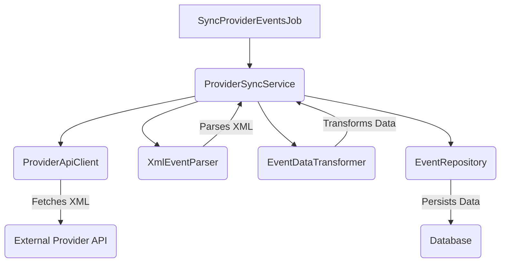
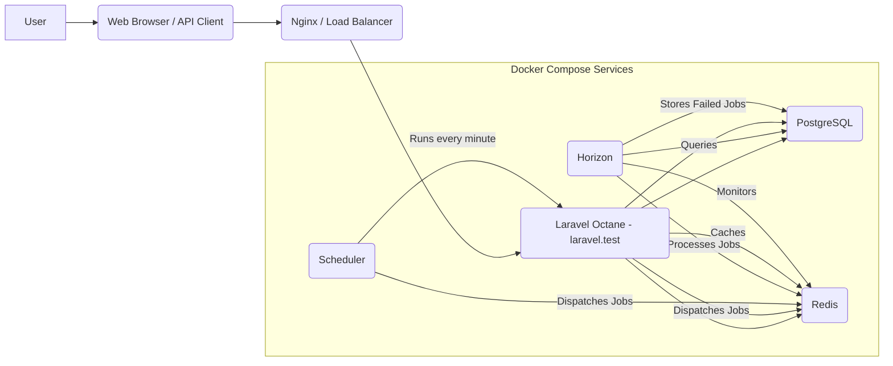
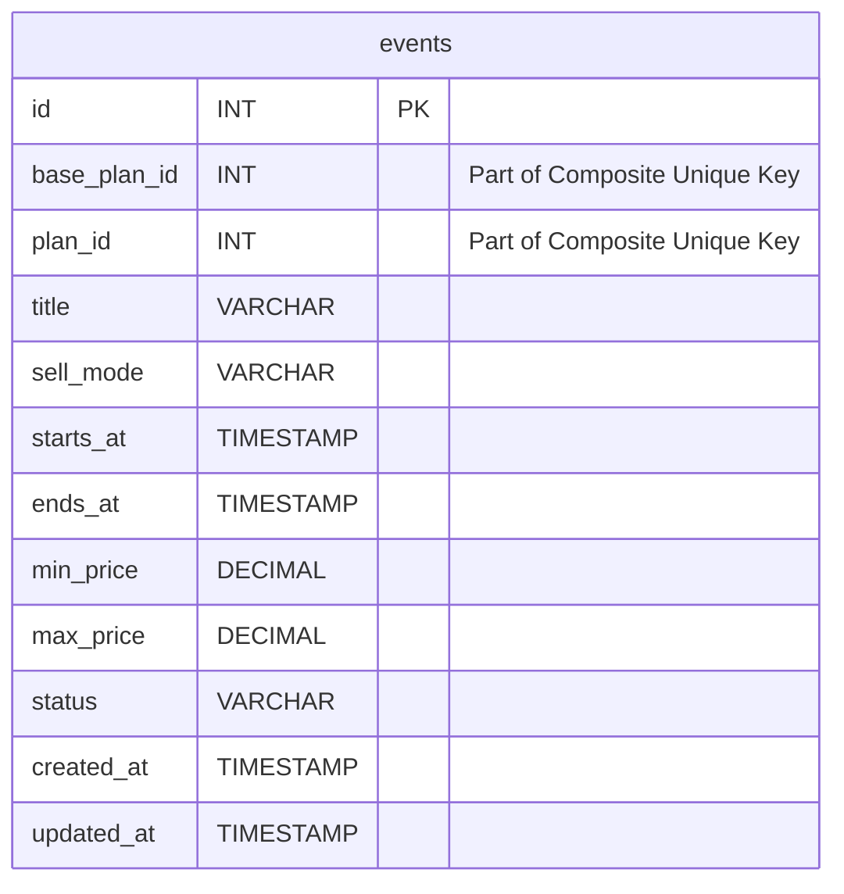
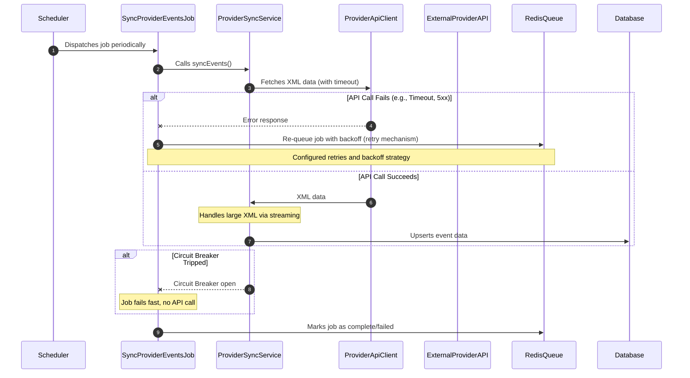

# Fever Code Challenge Solution

This repository contains the solution for the Fever Code Challenge, developed as a microservice to integrate external provider plans into the Fever marketplace. This document details the architecture, setup, and usage of the solution.

## Table of Contents
- [Fever Code Challenge Solution](#fever-code-challenge-solution)
  - [Table of Contents](#table-of-contents)
  - [Introduction](#introduction)
  - [Setup](#setup)
  - [Architecture](#architecture)
    - [Code Architecture](#code-architecture)
    - [Infrastructure Architecture](#infrastructure-architecture)
    - [Database Schema](#database-schema)
    - [Job Synchronization and Resilience](#job-synchronization-and-resilience)
  - [Usage](#usage)
  - [Testing](#testing)
  - [Load and Stress Testing](#load-and-stress-testing)
  - [Future Improvements](#future-improvements)

## Introduction
This project implements a Laravel-based microservice designed to efficiently synchronize event data from an external XML provider and expose it via a performant API. The solution emphasizes clean architecture, scalability, and maintainability, addressing various real-world challenges such as high traffic, data synchronization, and robust error handling.

## Setup
To get the project up and running on your local machine, follow these steps:

1.  **Clone the repository:**
    ```bash
    git clone <repository-url>
    cd <project-directory>
    ```
2.  **Create and review the environment file:**
    ```bash
    cp .env.example .env
    # Open .env and review/update database credentials, APP_PORT, etc.
    ```
3.  **Run the automated setup command:**
    This command will build Docker images, install dependencies, generate the application key, install Octane/Horizon, and run database migrations.
    ```bash
    make setup
    ```
    After this, the application should be fully operational.

## Architecture

### Code Architecture
The application's core synchronization logic adheres strictly to SOLID principles, particularly the Single Responsibility Principle. The `ProviderSyncService` acts as an orchestrator, delegating specific tasks to specialized components.



### Infrastructure Architecture
The solution leverages Docker Compose to orchestrate multiple services, providing a robust and scalable local development environment.



### Database Schema
The primary data store is a PostgreSQL database. The `events` table is designed to store the synchronized plan data. Uniqueness is enforced on a composite key to correctly model the provider's data structure.



### Job Synchronization and Resilience
The `SyncProviderEventsJob` is crucial for maintaining up-to-date event data. This diagram illustrates its interaction with the `ProviderSyncService`, including error handling, retries with backoff, and circuit breaker patterns to ensure resilience and efficient handling of external API interactions.



## Usage
Once the setup is complete and containers are running (`make run`), the application is fully automated.

-   **Access the Web Application:** `http://localhost:${APP_PORT}` (e.g., `http://localhost:8088`)
-   **Access Horizon Dashboard:** `http://localhost/horizon`
-   **Access Swagger UI:** `http://localhost:${APP_PORT}/api/documentation` (e.g., `http://localhost:8088/api/documentation`)
-   **Automatic Synchronization:** The `SyncProviderEventsJob` runs automatically every hour (or as configured in `.env` via `EVENT_SYNC_SCHEDULE`). You can monitor its execution and status in the Horizon dashboard.
-   **Compare APIs:**
    ```bash
    make compare-apis
    ```
    This command compares the current API specification with a previous version.
-   **Destroy Application:**
    ```bash
    make destroy
    ```
    This command stops and removes all Docker containers, networks, and volumes associated with the application, effectively cleaning up the environment.

## Testing
The project includes a comprehensive testing suite.

-   **Run Unit & Feature Tests:**
    ```bash
    make test
    ```
-   **Run Code Style Check:**
    ```bash
    make lint
    ```
## Load and Stress Testing
The project includes various load and stress testing profiles using k6 to evaluate the microservice's performance under various traffic conditions.

-   Light load:
    ```bash
    make test-load-light
    ```
-   Medium load (default):
    ```bash
    make test-load
    ```
    or
    ```bash
    make test-load-medium
    ```
-   Heavy load:
    ```bash
    make test-load-heavy
    ```
-   Extreme load (RPS-based):
    ```bash
    make test-load-extreme
    ```

## Future Improvements
-   Implement HTTP caching (e.g., Varnish) for the API.
-   Investigate database read replicas for further scalability.
-   Enhance error handling and notifications for job failures.
-   Implement a more granular delisting strategy (currently assumes `plan_id` is sufficient).